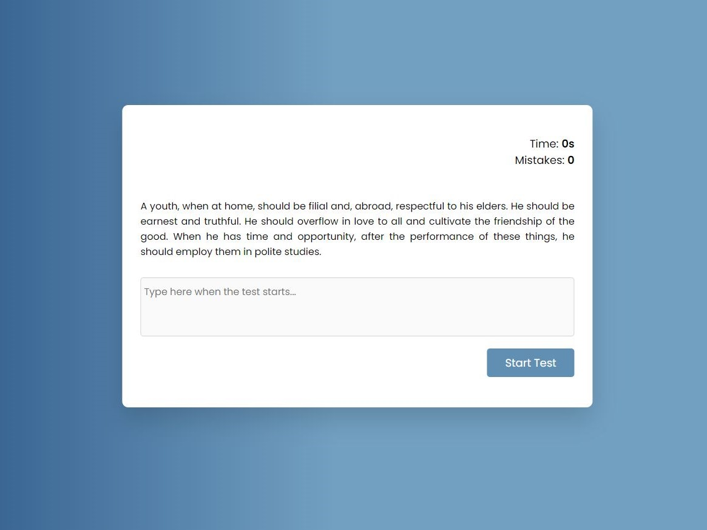
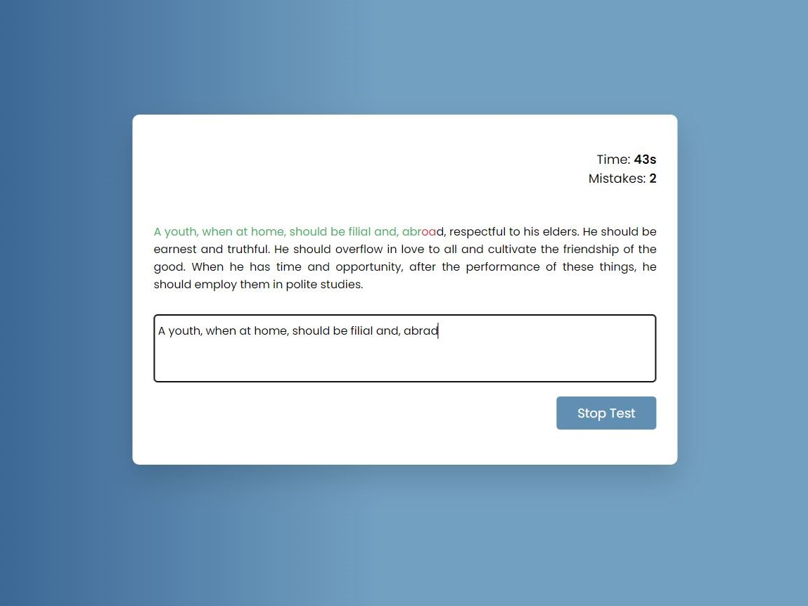
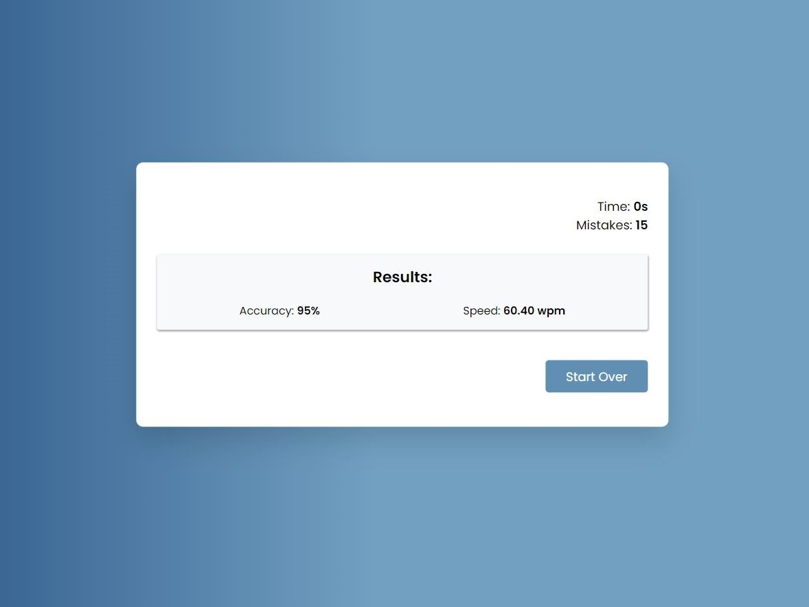

# Type Speed Test
> The app was created using vanilla JavaScript, HTML, and CSS and allows users 
to take a 60 second type speed tests and returns their accuracy and speed at the
end of the test.

## Table of Contents
* [General Info](#general-information)
* [Links](#links)
* [Technologies Used](#technologies-used)
* [Screenshots](#screenshots)
* [Project Status](#project-status)
* [Room for Improvement](#room-for-improvement)
* [Contact](#contact)

## General Information
This project has the following features:
- Calls a public random text generator and displays a text between 300 and 500
characters long on window load.
- Input box that is disabled until the start button is clicked.
- Once the user clicks the start button, a time will count down from 60 seconds.
The test ends when the 60 seconds are up or when the user clicks the stop button.
- As the user types, correctly typed characters are marked green and incorrectly
typed characters are marked red.
- Each mistyped characters is added to a mistakes counter.
- A function calculates the overall accuracy and type speed at the end of the test.

## Links
- Live Demo URL: [https://marlisarebaum.github.io/type-speed-test/](https://marlisarebaum.github.io/type-speed-test/)

## Technologies Used

## Screenshots

#### Start Screen:

#### During Test:

#### Test Results:

## Project Status
Project is:  _complete_ 

## Room for Improvement
Some areas of improvement include:
- When the "restart" button is clicked, the "stop" button sometimes quickly shows
up and then disappears as the function that sets it to display:none is not loaded
until after the window is loaded. Having the function load before the window is
loaded would make for a better user experience.

## Contact
Created by [Marlisa Rebaum](https://www.linkedin.com/in/marlisarebaum/) - feel free to contact me!